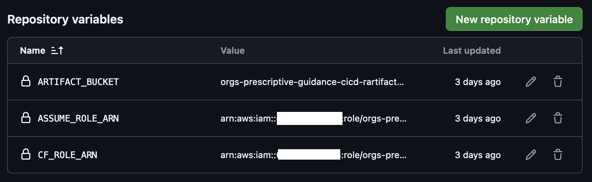
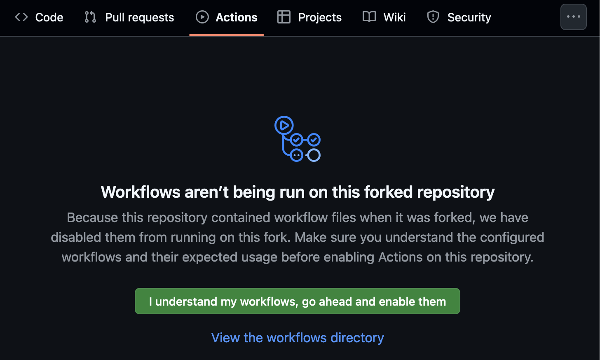
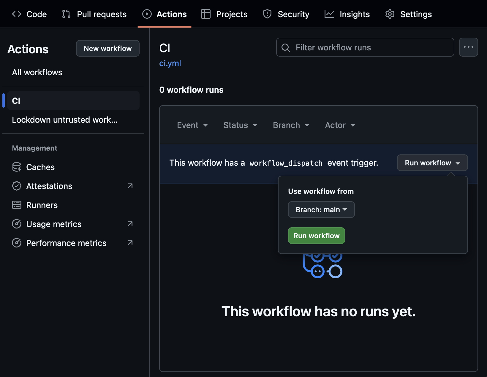
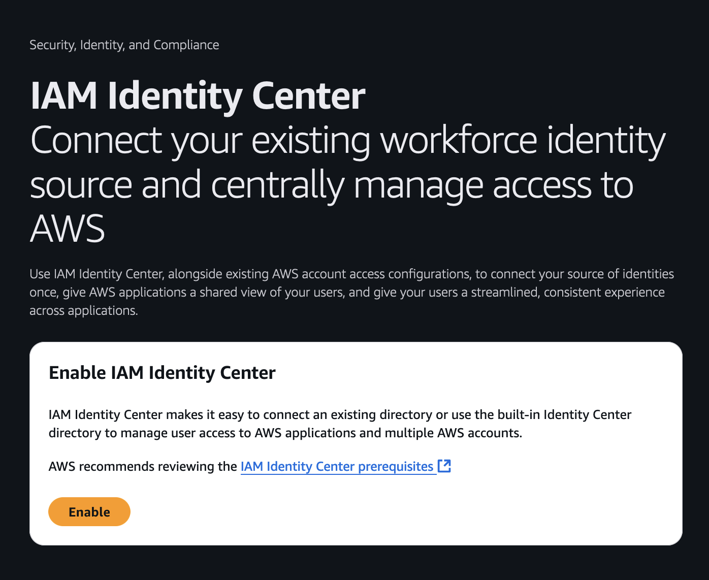

# Guidance for Organization on AWS 

### Table of contents

- [Guidance for Organization on AWS](#guidance-for-organization-on-aws)
    - [Table of contents](#table-of-contents)
  - [Introduction](#introduction)
  - [Prerequisites](#prerequisites)
  - [Tools and services](#tools-and-services)
  - [Usage](#usage)
      - [Parameters](#parameters)
      - [Installation](#installation)
      - [Enabling Control Tower](#enabling-control-tower)
  - [Use Cases](#use-cases)
      - [Emergency Access](#emergency-access)
      - [To Access an EC2 Instance](#to-access-an-ec2-instance)
  - [Clean up](#clean-up)
  - [Reference](#reference)
  - [Contributing](#contributing)
  - [License](#license)

## Introduction

This repository contains a collection of [AWS CloudFormation](https://aws.amazon.com/cloudformation/) templates to create up an [AWS Organizations](https://aws.amazon.com/organizations/) structure.

## Prerequisites

- [AWS Command Line Interface (AWS CLI)](https://docs.aws.amazon.com/cli/latest/userguide/install-cliv2.html) version 2, installed

## Tools and services

- [AWS SAM](https://aws.amazon.com/serverless/sam/) - The AWS Serverless Application Model (SAM) is an open-source framework for building serverless applications. It provides shorthand syntax to express functions, APIs, databases, and event source mappings.
- [AWS Control Tower](https://aws.amazon.com/controltower/) - AWS Control Tower provides the easiest way to set up and govern a secure, multi-account AWS environment, called a landing zone.
- [AWS Organizations](https://aws.amazon.com/organizations/) - AWS Organizations helps you centrally manage and govern your environment as you grow and scale your AWS resources.
- [AWS Service Catalog](https://aws.amazon.com/servicecatalog/) - AWS Service Catalog allows organizations to create and manage catalogs of IT services that are approved for use on AWS.

## Usage

#### Parameters

| Parameter                |  Type  |         Default          | Description          |
| ------------------------ | :----: | :----------------------: | -------------------- |
| pInstanceArn             | String |  _None_  | Optional - AWS IAM Identity Center instance ARN |
| pDeveloperPrefix         | String | app | Prefix used by developers when creating IAM roles and CloudFormation stacks |
| pCloudFormationRoleName  | String | CloudFormationRole | Name of the IAM role used by AWS CloudFormation |
| pServiceCatalogRoleName  | String | ServiceCatalogRole | Name of the IAM role used by AWS Service Catalog |
| pRegions                 | CommaDelimitedList | us-east-1 | Comma-delimited list of AWS Regions |
| pSandboxOuName           | String | Sandbox | Name of the organizational unit for sandbox AWS accounts |
| pSecurityOuName          | String | Security_Prod | Name of the organizational unit for security-related AWS accounts |

#### Installation

To deploy the sample template, first install the [AWS CLI](https://docs.aws.amazon.com/cli/latest/userguide/getting-started-install.html). [Fork](https://github.com/aws-samples/orgs-prescriptive-guidance/fork) this respository to your own GitHub owner account. Then execute these commands to check out the sample from GitHub and deploy a CloudFormation template that creates an IAM role that will be used by GitHub Actions to deploy the sample.

```bash
git clone https://github.com/<your Github Owner>/orgs-prescriptive-guidance
cd orgs-prescriptive-guidance
aws --region us-east-1 cloudformation deploy \
  --template-file github_ci_template.yml \
  --stack-name orgs-prescriptive-guidance-cicd \
  --capabilities CAPABILITY_IAM CAPABILITY_NAMED_IAM \
  --parameter-overrides pGithubOrganization=<your GitHub Owner> pGitHubRepository=orgs-prescriptive-guidance

aws --region us-east-1 cloudformation describe-stacks --stack-name orgs-prescriptive-guidance-cicd --query "Stacks[0].Outputs"
```

Then, follow this [guide](https://docs.github.com/en/actions/writing-workflows/choosing-what-your-workflow-does/store-information-in-variables#creating-configuration-variables-for-a-repository) to create GitHub Action variables in the repository:

* `ARTIFACT_BUCKET` = value of `oArtifactBucket` from above
* `ASSUME_ROLE_ARN` = value of `oGitHubRoleArn` from above
* `CF_ROLE_ARN` = value of `oCloudFormationRoleArn` from above

The variables should look like the image below:



Next we will run the deployment from Github Actions. If it's the first time you're accesing the Actions tab from a fork, you might need to enable the Actions feature for your fork.



Now, you can trigger the GitHub Actions workflow by clicking the `Run workflow` button in the GitHub Actions UI.



After the GitHub Actions deployment is successful, navigate to [IAM Identity Center](https://console.aws.amazon.com/singlesignon/home) in the AWS Console and `Enable` IAM Identity Center.



On the next screen, click `Go to settings`. Copy the value of the `Instance ARN` (it will look like `arn:aws:sso:::instance/ssoins-XXXXXX`) to your clipboard.

Next we want to update the CloudFormation stack with the IAM Identity Center Instance ARN to provision a set of [Permission Sets](https://docs.aws.amazon.com/singlesignon/latest/userguide/permissionsetsconcept.html).

```bash
aws --region us-east-1 cloudformation update-stack \
  --stack-name DO-NOT-DELETE-organization \
  --use-previous-template \
  --parameters "ParameterKey=pInstanceArn,ParameterValue=arn:aws:sso:::instance/ssoins-XXXX" \
  --capabilities CAPABILITY_NAMED_IAM
```

#### Enabling Control Tower
To enable Control Tower you can deploy the cloudformation template _enable_control_tower.yml_.
Please note that the deployment of the sample template _template.yml_ is not a requirement for deploying _enable_control_tower.yml_, only a recommendation. 
_enable_control_tower.yml_ will by default create a new Organization.

```bash
git clone https://github.com/<your Github Owner>/orgs-prescriptive-guidance
cd orgs-prescriptive-guidance
aws --region us-east-1 cloudformation deploy \
  --template-file enable_control_tower.yml \
  --stack-name control-tower \
  --capabilities CAPABILITY_IAM CAPABILITY_NAMED_IAM \
  --parameter-overrides pLogArchiveAccountEmailAddress=<Your wanted Log Archive account email address> pSecurityAccountEmailAddress=<Your wanted Security account email address>
```

## Use Cases

#### Emergency Access

In the event that there are any issues with AWS IAM Identity Center, IAM users `EmergencyAccess_RO` and `EmergencyAccess_Ops` have been deployed in the management account. These users can assume IAM roles `EmergencyAccess_RO` and `EmergencyAccess_Ops` in every account. These users thus have privileged access to all accounts which necessitates that they be used sparingly in a secure manner.

There are no credentials associated with these users. To set credentials, and enable multi-factor authentication for these users, follow these [instructions](https://docs.aws.amazon.com/IAM/latest/UserGuide/id_credentials_mfa_enable.html) to configure MFA devices for each EmergencyAccess user.

#### To Access an EC2 Instance

After installing the AWS CLI, install the [AWS Systems Manager Session Manager plugin](https://docs.aws.amazon.com/systems-manager/latest/userguide/session-manager-working-with-install-plugin.html
).

```bash
aws sso login --profile <profile-name>
aws --profile <profile-name> ssm start-session --target <instance-id> --document-name SSM-SessionManagerRunShell
```

## Clean up

Deleting the CloudFormation Stack will remove the CloudFormation StackSets, IAM Identity Center Permission Sets, and the AWS Organization.

```
sam delete
```

## Reference

This solution is inspired by these references:

- [AWS Security Reference Architecture](https://docs.aws.amazon.com/prescriptive-guidance/latest/security-reference-architecture/architecture.html)

## Contributing

See [CONTRIBUTING](CONTRIBUTING.md#security-issue-notifications) for more information.

## License

This library is licensed under the MIT-0 License. See the LICENSE file.

